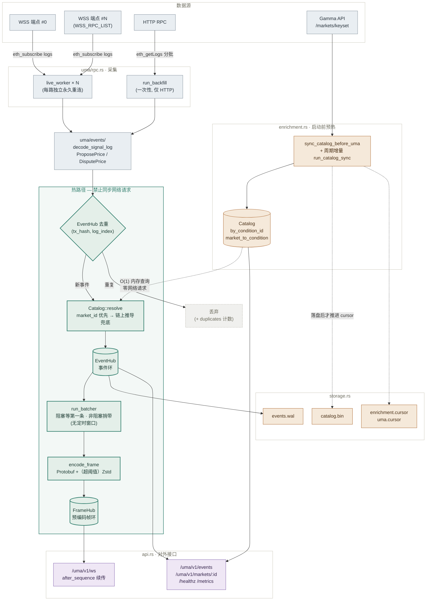
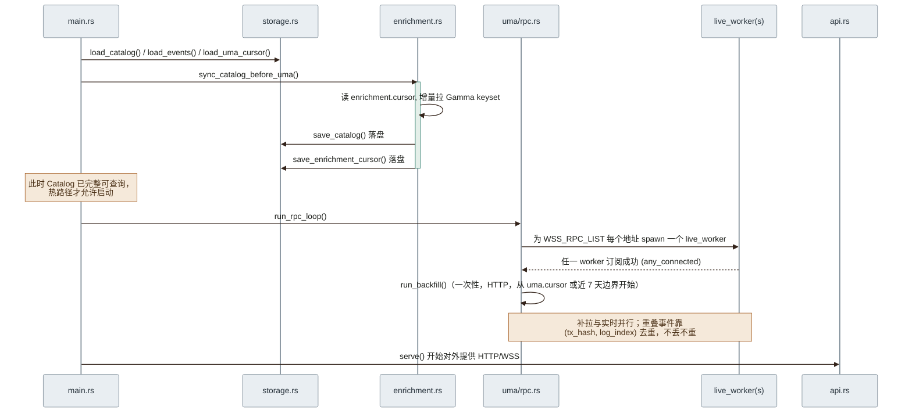
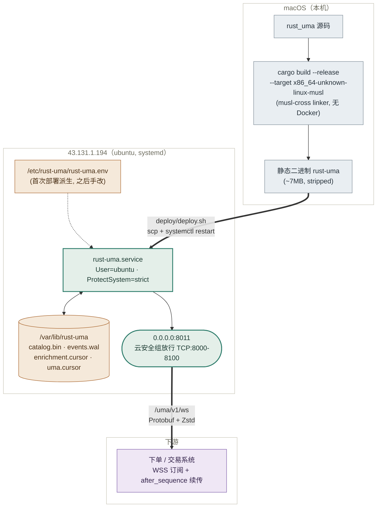

# rust_uma 架构图

配套阅读 [WORKFLOW.md](WORKFLOW.md)（尤其是"热路径铁律"）。本文档只画结构，
不重复解释设计取舍。

## 1. 数据流总览

链上事件到下游广播的完整路径，以及 Gamma 富化缓存如何在启动前预热、之后只
做本地内存查询（不进入热路径）。

阴影部分（`decode` → `EventHub` → `run_batcher` → `FrameHub`）是延迟敏感的
热路径：不落地等待、不发起同步网络请求，`Catalog` 是它唯一的外部依赖，而且
只读内存。

## 2. 启动顺序

`main.rs::run()` 强制这个顺序，任何重构都不能打乱它——先有完整可用的富化缓
存，链上事件才开始进入热路径。

## 3. 部署拓扑

