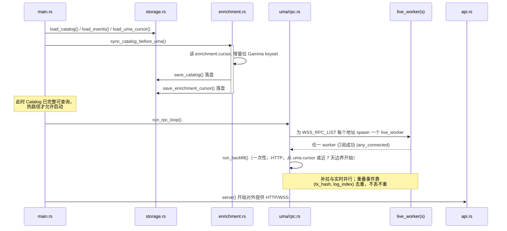
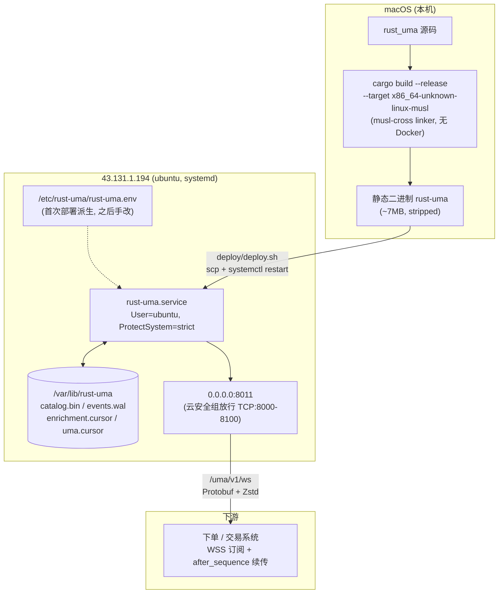

# rust_uma 架构图

配套阅读 [WORKFLOW.md](WORKFLOW.md)（尤其是"热路径铁律"）。本文档只画结构，
不重复解释设计取舍。

## 1. 数据流总览

链上事件到下游广播的完整路径，以及 Gamma 富化缓存如何在启动前预热、之后只
做本地内存查询（不进入热路径）。

```mermaid
flowchart LR
    subgraph chain["Polygon 链"]
        WSS1["WSS 端点 #0"]
        WSS2["WSS 端点 #N\n(WSS_RPC_LIST)"]
        HTTP["HTTP RPC\n(eth_getLogs 补拉)"]
    end

    subgraph gamma_src["Gamma / Polymarket"]
        GAPI["Gamma API\n/markets/keyset"]
    end

    subgraph rpc["uma/rpc.rs"]
        LW0["live_worker #0"]
        LWN["live_worker #N"]
        BF["run_backfill\n(一次性, 仅 HTTP)"]
    end

    subgraph decode["uma/events/"]
        DEC["decode_signal_log\nProposePrice / DisputePrice\nancillary 强类型解析"]
    end

    subgraph enrich["enrichment.rs"]
        CAT[("Catalog\nby_condition_id\nmarket_to_condition")]
        SYNC["sync_catalog_before_uma\nrun_catalog_sync (周期增量)"]
    end

    subgraph pipe["pipeline.rs :: Processor"]
        DEDUP{"EventHub\n(tx_hash, log_index)\n去重"}
        RESOLVE["Catalog::resolve\nmarket_id 优先\n→ 链上推导兜底"]
    end

    subgraph broadcast["hub.rs + wire.rs"]
        ERING[("EventHub\n事件环")]
        BATCH["run_batcher\n(先阻塞等第一条,\n非阻塞捎带, 无定时窗口)"]
        ENC["encode_frame\nProtobuf + Zstd(阈值触发)"]
        FRING[("FrameHub\n预编码帧环")]
    end

    subgraph store["storage.rs"]
        WAL["events.wal"]
        SNAP["catalog.bin"]
        CUR["enrichment.cursor\numa.cursor"]
    end

    subgraph api["api.rs"]
        WSAPI["/uma/v1/ws\n(watch 推送, after_sequence 续传)"]
        HTTPAPI["/uma/v1/events\n/uma/v1/markets/:id\n/healthz /metrics"]
    end

    WSS1 -->|eth_subscribe logs| LW0
    WSS2 -->|eth_subscribe logs| LWN
    HTTP -->|eth_getLogs 分批| BF

    LW0 --> DEC
    LWN --> DEC
    BF --> DEC

    GAPI --> SYNC --> CAT
    SYNC -.->|落盘后才推进 cursor| SNAP
    SYNC -.-> CUR

    DEC --> DEDUP
    DEDUP -->|重复| DROP["丢弃 + duplicates 计数"]
    DEDUP -->|新事件| RESOLVE
    CAT -.->|O(1) 内存查询, 零网络请求| RESOLVE
    RESOLVE --> ERING
    ERING --> WAL
    ERING --> BATCH
    BATCH --> ENC --> FRING
    FRING --> WSAPI
    ERING --> HTTPAPI
    CAT --> HTTPAPI

    classDef hot fill:#2f7d6c22,stroke:#2f7d6c,stroke-width:2px;
    class DEC,DEDUP,RESOLVE,ERING,BATCH,ENC,FRING hot;
```

阴影部分（`decode` → `EventHub` → `run_batcher` → `FrameHub`）是延迟敏感的
热路径：不落地等待、不发起同步网络请求，`Catalog` 是它唯一的外部依赖，而且
只读内存。

## 2. 启动顺序

`main.rs::run()` 强制这个顺序，任何重构都不能打乱它——先有完整可用的富化缓
存，链上事件才开始进入热路径。



## 3. 部署拓扑


