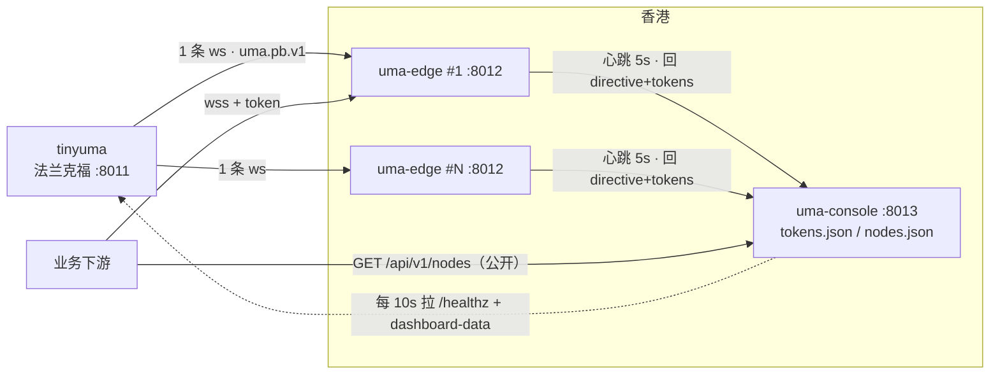

# uma-edge / uma-console 设计

> 状态：2026-09-07 定稿并实现。console 上线于 uma-console.chainee.space；edge 见 `src/edge/`。
> 与实现的差异：EDGE_UPSTREAM_URL 里的 `after_sequence` 在首次拨号时保留（`?after_sequence=0` 可预热帧环）；
> 上游延迟只统计 10s 内的实时帧；drain/心跳周期等指令字段 console 目前回 0（edge 用本地默认）。
> 参考：[rust-edge-migration-spec.md](rust-edge-migration-spec.md)（Go 版迁移规格，只作参考，
> 本文与其冲突处以本文为准）。热路径要求见 [WORKFLOW.md](WORKFLOW.md) §1.1。

## 1. 目标与边界

- tinyuma 只做源头，不再直接承受业务下游连接。edge 每节点一条上游连接，本地帧环，
  帧原样扇出，支持 `after_sequence`/`_replay` 回放。
- console 是唯一运维入口：聚合 tinyuma 状态、收集 edge 心跳、管理 token、发布节点列表。
- 规模：每节点几百连接，总计 1000 以内。
- 不做：业务解析、事件内容展示、HTTP 历史、跨节点帧环、过期 token、客户端 RTT 探测。

## 2. 拓扑



法兰克福到香港约 190ms 是物理延迟，edge 的价值是把跨洲连接收敛为每节点 1 条，
并让重连和回放在香港本地完成。

## 3. 代码落点

```text
src/bin/uma-edge.rs        入口，只做 config + 拼装
src/bin/uma-console.rs     入口
src/edge/mod.rs
src/edge/frame.rs          帧头校验 + varint 走查 batch_sequence / 最大 event sequence（zstd 帧解压后走查）
src/edge/ring.rs           VecDeque<Arc<Frame>> 固定容量帧环
src/edge/hub.rs            订阅者表，每客户端 mpsc 有界通道，try_send 失败即摘除（1008）
src/edge/upstream.rs       单上游连接，退避重连，after_sequence，1013 处理
src/edge/auth.rs           token 集合（来自 console 或 env），握手本地比对
src/edge/server.rs         axum 路由、WS 升级、drain、信号
src/edge/heartbeat.rs      心跳上报、执行 directive、更新 token 集合
src/console/mod.rs
src/console/registry.rs    节点表、状态判定、权重、列表
src/console/tokens.rs      token 表（生成/启用/禁用/删除）
src/console/store.rs       持久化：原子写 JSON（write tmp + rename）
src/console/upstream.rs    定时拉 tinyuma /healthz 与 dashboard-data，缓存
src/console/server.rs      路由、鉴权、面板页
internal/console/index.html 面板（include_str!）
internal/console/llms_cluster.txt 集群接入契约（include_str!，与上游 llms 合并输出）
deploy/uma-edge.service / uma-console.service / deploy-edge.sh
```

`src/lib.rs` 暴露 `edge`、`console` 两个模块，复用 `wire.rs` 的帧头常量与 `config.rs`
的 env 读取辅助函数。共享 `Cargo.toml`，不新增运行时依赖（`rand` 用于退避抖动和
token 生成，可加）。

## 4. edge

### 4.1 上游

- 单任务单连接，子协议 `uma.pb.v1`，握手后校验回包子协议，不一致视为失败。
- 退避 1s 起 ×2 封顶 15s 加 0–25% 抖动；20s Ping，60s 无帧/无 Pong 判死。
- 拨号带 `after_sequence=<last_event_seq>`，收到 1013 后下一次不带。
- 每帧：`parse_frame`（失败仍转发，只计数）→ 更新 `last_event_seq` → `ring.push` →
  `hub.broadcast`。解析出的 `sent_at_us` 与本地接收时刻之差记为 `upstream_lag_us`
  （最近值与最大值），这是面板上"法兰克福→香港传输延迟"的来源。
- 只处理 Binary，Text 丢弃。

### 4.2 帧环与扇出

- 帧环容量 `EDGE_RING_FRAMES`（默认 4096），满则弹出最旧。
- `subscribe(replay)` 在同一把同步锁内取 `tail(replay)` 快照并注册，保证不重不漏。
- 广播只做 `Arc` clone 与 `try_send`，绝不 `.await` 客户端；记录整轮耗时
  `fanout_last_us / fanout_max_us`。
- 每客户端 `mpsc::channel(EDGE_CLIENT_QUEUE)`（默认 128），满即摘除，关闭码 1008。

### 4.3 客户端入口 `GET /uma/v1/ws`

顺序：token 校验（`?token=` 或 Bearer）→ draining 503 → 达 `max_clients` 503 →
未提供子协议 `uma.pb.v1` 400 → `_replay`（`0..=4096` 或 `all`，非法 400）→ 升级。

token 校验规则：
- 集合来源优先级：console 下发的集合 > `EDGE_CLIENT_TOKENS` 环境变量（应急）。
- 两者都为空（含启动后尚未收到 console 下发）→ 拒绝所有握手（401），不放行。
- 每个连接记住它用的 token id；token 被禁用/删除时，edge 收到新集合后主动以
  1008 踢掉对应连接。

每连接两个任务：写任务顺序写回放快照（单帧写超时 5s）再循环 `rx.recv()`，30s Ping；
读任务丢弃数据帧，90s 无消息断开，退出时注销并通知写任务。关闭码：1000 正常、
1008 慢客户端或 token 失效、1012 摘流。

### 4.4 其他路由

| 路径 | 行为 |
|---|---|
| `GET /edge/ready` | `!draining && upstream_connected` → 200，否则 503 |
| `GET /edge/healthz` | 与心跳同一个 JSON |
| `GET /edge/admin/clients` | Bearer `EDGE_ADMIN_TOKEN` |
| `POST /edge/admin/rebalance` | `{"count":n}` 以 1012 释放 n 个 |
| `POST /edge/admin/drain` | 触发 drain，202 |
| 其他 | 404，不提供 `/llms.txt` |

drain：单向，`draining=true` → 每 `EDGE_DRAIN_INTERVAL` 释放 `EDGE_DRAIN_BATCH` 个
（1012）→ 归零或 `EDGE_DRAIN_TIMEOUT` → 由 admin/SIGTERM 触发的退出进程；
由 console directive 触发的不退出。

### 4.5 心跳

每 `EDGE_HEARTBEAT_INTERVAL`（默认 5s）`POST {console}/api/v1/nodes/heartbeat`，
Bearer `EDGE_CONSOLE_TOKEN`，超时 4s，复用一个 `reqwest::Client`。失败只记日志。
请求体见 §6.1，响应见 §6.2；响应里 `tokens_version` 与本地不同时全量替换 token 集合。

## 5. console

### 5.1 节点注册表（内存 + 持久化管理位）

- `upsert(heartbeat, remote_ip)`；同一 `node_id` 的 `started_at_ms` 变化 → 清
  `desired_drain`（重启清 drain）。
- 状态优先级：`stale`（>`CONSOLE_STALE_AFTER`，默认 15s）> `disabled` > `draining`
  > `not_ready` > `full` > `serving`。
- 公开列表只含 `serving`，`weight = max(1, max_clients - clients)`，降序。
- `disabled` 与 `note` 持久化到 `nodes.json`；`desired_drain` 不持久化。

### 5.2 token 表

- 字段：`id`（短随机串，面板显示用）、`secret`（32 字节随机，base64url，只在创建时
  完整返回一次，之后只显示前 6 位）、`name`、`enabled`、`created_at_ms`、`updated_at_ms`。
- 动作：创建、启用、禁用、删除、改备注。每次变更 `tokens_version += 1` 并落盘
  `tokens.json`（tmp + rename 原子写）。
- 下发给 edge 的集合只含 `enabled=true` 的 `{id, secret}`。
- 用量：edge 心跳带 `clients_by_token: {token_id: n}`，console 汇总后在面板按 token
  展示总连接数与分布节点。

### 5.3 tinyuma 聚合

每 `CONSOLE_UPSTREAM_POLL`（默认 10s）拉 `{CONSOLE_UPSTREAM_HTTP}/healthz` 与
`/uma/v1/dashboard-data?token=`，缓存最近一次成功结果与时间戳；失败沿用旧值并标
`stale`。面板显示时同时给出 `event_ring_latest_sequence`，用来算每个 edge 的序号滞后。

### 5.4 路由

| 路径 | 鉴权 | 行为 |
|---|---|---|
| `GET /` | 无 | 面板壳，JS 用 `?token=` 拉数据 |
| `GET /api/v1/nodes` | 无 | 公开节点列表，§6.3，`Cache-Control: max-age=<ttl>`，CORS `*` |
| `GET /llms.txt` | 无 | 集群契约 + 上游 llms（缓存 5 分钟） |
| `GET /healthz` | 无 | `{status, serving_nodes, known_nodes, version, commit, uptime_s}` |
| `POST /api/v1/nodes/heartbeat` | Bearer `CONSOLE_NODE_TOKEN` | body ≤64KiB，回 directive |
| `GET /api/v1/panel` | `?token=` = `CONSOLE_PANEL_TOKEN` | 面板一次性拉全量：tinyuma 缓存 + 全部节点 + token 用量 |
| `GET /api/v1/admin/nodes` | Bearer `CONSOLE_ADMIN_TOKEN` | 管理视图 |
| `POST /api/v1/admin/nodes/{id}/{drain\|undrain\|disable\|enable\|forget}` | admin | 动作写日志含来源 IP |
| `PUT /api/v1/admin/nodes/{id}/note` | admin | `{"note":""}` |
| `GET /api/v1/admin/tokens` | admin | 列表（secret 只显示前缀） |
| `POST /api/v1/admin/tokens` | admin | `{"name":""}` → 返回完整 secret（仅此一次） |
| `POST /api/v1/admin/tokens/{id}/{enable\|disable}` | admin | |
| `DELETE /api/v1/admin/tokens/{id}` | admin | |

`CONSOLE_NODE_TOKEN`、`CONSOLE_ADMIN_TOKEN`、`CONSOLE_PANEL_TOKEN` 任一为空启动失败。

### 5.5 面板

单文件 HTML，无构建步骤。三块：
1. tinyuma：连接状态、RPC 源抢达率、事件序号、富化命中、订阅者数、最近广播时刻。
2. 节点：每行 node_id / 状态 / 连接数 / max / 序号滞后 / 上游延迟 / 帧率 / 慢客户端 /
   最近心跳；输入 admin token 后出现 drain/disable/forget 按钮。
3. token：名称 / 前缀 / 状态 / 当前连接数 / 创建时间；创建后弹一次完整 secret。

## 6. JSON 契约（重新定义，字段风格与 tinyuma 的 dashboard-data 一致）

### 6.1 Heartbeat（edge → console，也是 `GET /edge/healthz`）

```text
node_id version commit started_at_ms sent_at_ms
advertise_host port tls path subprotocol
ready draining
upstream_url upstream_connected upstream_reconnects_total
last_frame_at_ms frames_total bytes_total bad_frames_total
last_event_sequence ring_frames ring_capacity
upstream_lag_last_us upstream_lag_max_us
clients max_clients clients_accepted_total clients_rejected_total
slow_clients_disconnected_total deliveries_total
fanout_last_us fanout_max_us
tokens_version clients_by_token{token_id: n}
```

### 6.2 Directive（console → edge）

```text
drain drain_batch drain_interval_ms heartbeat_seconds
tokens_version tokens:[{id, secret}]   # 仅当 edge 上报的 tokens_version 落后时携带
```

### 6.3 NodeList（`GET /api/v1/nodes`）

```json
{"nodes":[{"node_id":"hk-1","url":"wss://1.2.3.4:8012/uma/v1/ws","weight":812,"clients":188}],
 "subprotocol":"uma.pb.v1","path":"/uma/v1/ws","ttl_s":30,"generated_at_ms":0}
```

下游取 `nodes[0]`，失败则顺延；按 `ttl_s` 重新拉取。

## 7. 配置

edge：`EDGE_LISTEN_ADDR`(0.0.0.0:8012) `EDGE_UPSTREAM_URL` `EDGE_CONSOLE_URL`
`EDGE_CONSOLE_TOKEN` `EDGE_NODE_ID`(hostname) `EDGE_ADVERTISE_HOST` `EDGE_ADVERTISE_PORT`
`EDGE_ADVERTISE_TLS`(0/1) `EDGE_CLIENT_QUEUE`(128) `EDGE_RING_FRAMES`(4096)
`EDGE_MAX_CLIENTS`(1000) `EDGE_ADMIN_TOKEN` `EDGE_CLIENT_TOKENS`(应急，逗号分隔)
`EDGE_DRAIN_BATCH`(20) `EDGE_DRAIN_INTERVAL`(2s) `EDGE_DRAIN_TIMEOUT`(10m)
`EDGE_HEARTBEAT_INTERVAL`(5s)

console：`CONSOLE_LISTEN_ADDR`(0.0.0.0:8013) `CONSOLE_NODE_TOKEN` `CONSOLE_ADMIN_TOKEN`
`CONSOLE_PANEL_TOKEN` `CONSOLE_DATA_DIR`(/var/lib/uma-console) `CONSOLE_STALE_AFTER`(15s)
`CONSOLE_LIST_TTL_SECONDS`(30) `CONSOLE_UPSTREAM_HTTP`(http://43.131.1.194:8011)
`CONSOLE_UPSTREAM_DASHBOARD_TOKEN` `CONSOLE_UPSTREAM_POLL`(10s)

## 8. 部署

- `deploy/deploy-edge.sh`：同 `deploy.sh` 的 musl 交叉编译，参数选 `uma-edge` 或
  `uma-console` 与目标主机；目录 `/opt/uma-edge`、`/opt/uma-console`，env 在
  `/etc/uma-edge/`、`/etc/uma-console/`，`StateDirectory=uma-console`。
- tinyuma 侧：安全组把 8011 收紧到只放行香港各 edge 与 console 的出口 IP。

## 9. 必须有测试的不变量

1. 上游只有一条连接；重连带 `after_sequence`，1013 后一次不带。
2. 帧字节原样转发，Text 不转发。
3. 回放与实时不重不漏（回放 5 帧后第 6 帧序号紧接）。
4. 广播永不等待客户端；队列满即 1008 摘除，其余不受影响。
5. drain 单向：ready 503、新握手 503、按批 1012、归零或超时。
6. 重启清 drain（`started_at_ms` 变化）。
7. 状态优先级与权重；stale 绝不进公开列表。
8. 子协议强制：客户端未提供 → 400；上游未回 → 重连。
9. `_replay` 上限 4096，`all` 等价上限，非法 400。
10. token：无集合一律拒绝；禁用后新集合到达即踢在线连接（1008）；`tokens_version`
    相同不重复下发；`tokens.json` 写入原子且重启后可读回。
11. 持久化：`disabled`/`note` 重启保留，`desired_drain` 重启清空。
12. 压测：单节点 1000 连接、10 帧/s、2.7KB 帧，p99 <100ms，RSS <100MB。
